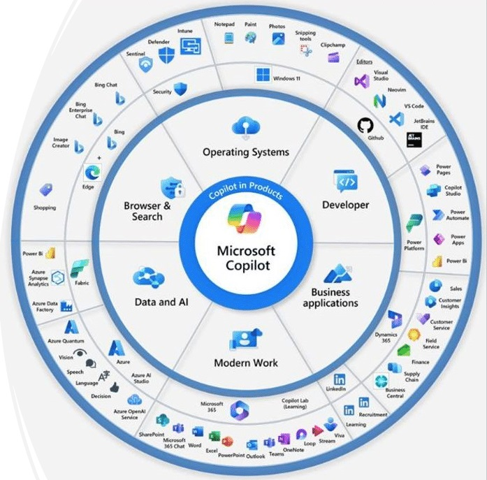
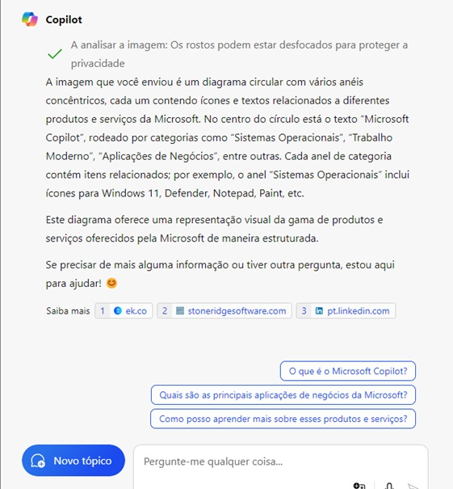

# Copilot_dio

### Terceiro Teste - Perfil de Destaque na DIO!

**Como Entregar esse Projeto?**

Chegou a hora de você construir um portfólio ainda mais rico e impressionar futuros recrutadores. Para isso, é sempre importante mostrar os resultados do seu esforço e como você os obteve, deixando claro o seu racional.

**Estrutura do Repositório:**
- `/input`: Contém as imagens utilizadas no projeto.
- `/output`: Contém os resultados de reconhecimento de texto das imagens.

**Processo:**
Descreva aqui o processo que você seguiu, as ferramentas que usou e como elas contribuíram para os resultados do projeto.

**Resultados:**
Aqui você pode inserir algumas imagens dos inputs e outputs para demonstrar visualmente os resultados do seu trabalho.

**Insights e Possibilidades:**
Descreva alguns insights e possibilidades que você aprendeu durante o conteúdo. Este é um ótimo lugar para refletir sobre o que foi feito e o potencial para futuros projetos.

**Como Entregar:**
Para entregar este projeto, certifique-se de compartilhar o link do seu repositório através do botão 'entregar projeto' disponível na plataforma DIO.

### Link do Repositório
[Visite meu Repositório!](https://github.com/fullstackwd/Copilot_dio)

